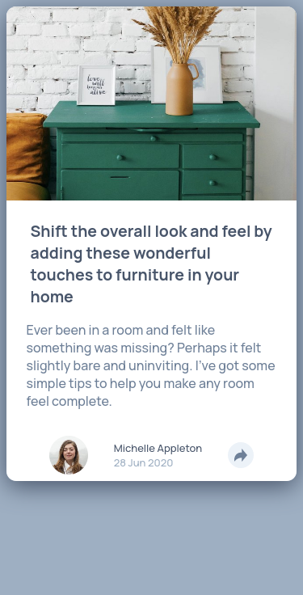
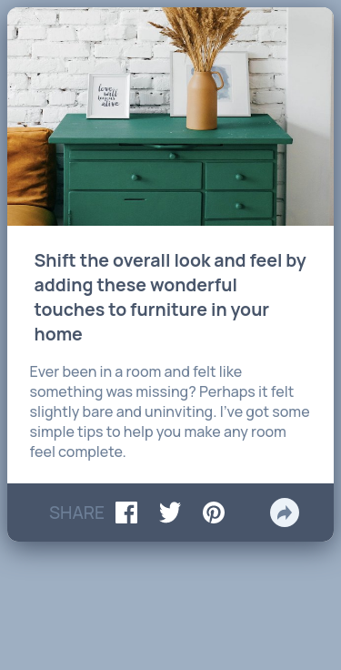
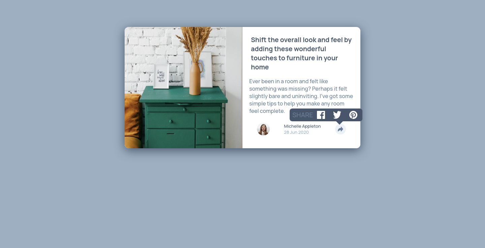

# Frontend Mentor - Article preview component solution Español

Esta es una solución para el [Article preview component challenge on Frontend Mentor](https://www.frontendmentor.io/challenges/article-preview-component-dYBN_pYFT). Los retos de Frontend Mentor pueden ayudarte a mejorar tus habilidades por medio de crear proyectos reales.

## Tabla de contenidos
- [Información general](#información-general)
  - [El reto](#el-reto)
  - [Screenshot](#screenshot)
  - [Links](#links)
- [Mi proceso](#mi-proceso)
  - [Herramientas utilizadas](#herramientas-utilizadas)
  - [Lo que aprendí](#lo-que-aprendí)
  - [Recursos](#recursos)
- [Autor](#autor)

## Información general

### El reto

- Ver correctamente el diseño dependiendo la resuloción del dispositivo.
- Ver los links para compartir cuando se de clic en el botón de compartir.

### Screenshot

Mobile

Mobile active state

Desktop

### Links

- URL para la solución: [Solution page](https://www.frontendmentor.io/solutions/article-preview-component-_ulR3eTK6)
- URL para probar el sitio: [Github pages](https://caresle.github.io/article-preview-component/)

## Mi proceso

### Herramientas utilizadas

- HTML
- CSS
- Flexbox
- CSS Grid
- Mobile-first workflow

### Lo que aprendí

Aprendí a resolver problemas a lo largo del proyecto.

- Como adaptar el código cuando agrego elementos al proyecto.
- Encontrar una manera para solucionar un problema con un tamaño específico de pantalla.

### Recursos

- [CSS Triangle](https://css-tricks.com/snippets/css/css-triangle/) - Esto me ayudo para hacer el triangulo en el menú de compartir.

## Autor

- Frontend Mentor - [@Caresle](https://www.frontendmentor.io/profile/Caresle)
- Instagram - [@caresle1](https://instagram.com/caresle1)